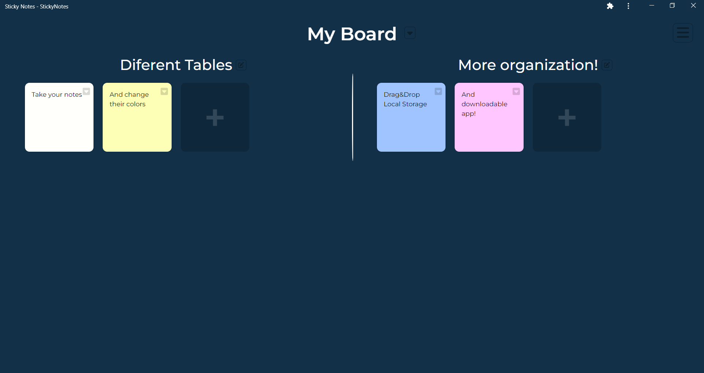

# Sticky Notes

Una aplicación web progresiva (PWA) para apuntar notas, hecha con Angular y bootstrap. Con diseño responsivo para adaptarse a los diferentes dispositivos.  
Funciona con un sistema de almacenamiento local y es capaz de ser descargada para funcionar totalmente offline.

## Screenshots

## Features

- Funcionamiento 100% offline.
- Apuntar notas.
- Cambiar color a las notas.
- Organizar las notas en Tableros y Pizzarras.
- Nombres de Tablas y Pizzarras personalizables.
- Multiplataforma.
- Almacenamiento local.
- Capacidad de importar y exportar datos.
- Arrastrar y soltar notas en diferentes tablas.
- Actualizaciones automáticas.

## Demo

Puedes probar y descargar la app aquí: 
[StickyNotes Web App](https://simple-sticky-notes.web.app/)

## 🔗 Links

